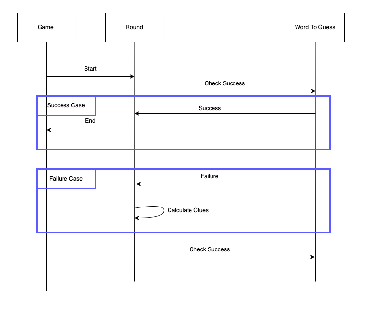

# Wordle

Each game a new word is released and players have six attempts to guess what the word of the day is. During the guesses, tiles will change colour to help players get the word.

Implementation schema

